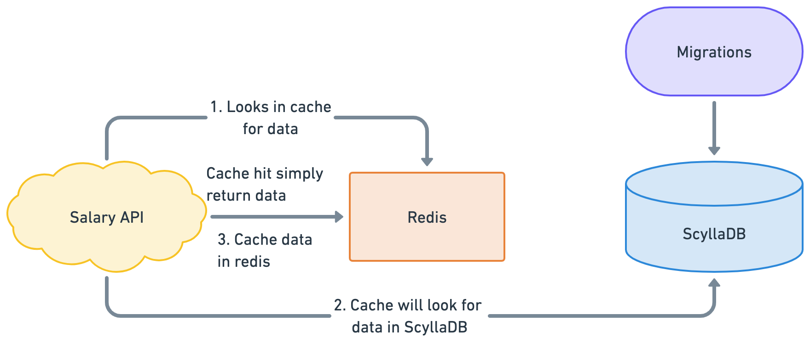

<p align="center">
  
</p>

Salary API is a Java based microservice which is responsible for all the salary related transactions and records in **[OT-Microservices](https://github.com/OT-MICROSERVICES)** stack. The application is platform independent and can be run on multiple operating system. **[Java Runtime](https://www.java.com/en/download/manual.jsp)** would be required to run this application.

Supported features of the Salary API are:-

- Spring boot based web framework, which uses tomcat as webserver.
- ScyllaDB is used as primary database for storing all the salary data.
- Redis as cache manager to store the cache response.
- Prometheus and Open-telemetry metrics support for monitoring and observability
- Swagger integration for the API documentation of endpoints and payloads.
- Database migration using the tool called **[migrate](https://github.com/golang-migrate/migrate)**.

## Pre-Requisites

The Salary API application have some database, cache manager and package dependencies. Some of the dependencies are optional and some are mandatory. To compile the application, we only need `maven` as build tool, but for running the application following things are required:-

- **[ScyllaDB](https://www.scylladb.com/)**
- **[Redis](https://redis.io/)**
- **[Migrate](https://github.com/golang-migrate/migrate)**
- **[Maven](https://maven.apache.org/)**

Maven will be used as package manager to download specific version of dependencies to run the Salary API.

## Architecture



## Application

For building the Salary API application, we can use `make` commands with our **[Makefile](./Makefile)**. But first, we need to install the dependencies which can be simply done using the `make` command.

```shell
make build
```

For building the docker image artifact of the attendance api, we can invoke another make command.

```shell
make docker-build
make docker-push
```

Also, Salary API contains different test cases and code quality related integrations. To check the code quality, we can use `checkstyle` plugin with maven. Also, for code coverage and unit testing, we are using Jacoco, and Junit respectively.

```shell
make fmt
make test
```

```shell
mvn checkstyle:checkstyle
# For unit testing and code coverage
mvn test
```

The test cases are present in **[src/test/java/com/opstree/microservice/salary](./src/test/java/com/opstree/microservice/salary)**. For dev testing, the Swagger UI can be used for sample payload generation and requests. The swagger page will be accessible on http://localhost:8080/salary-documentation.

Before running the application, we have to make sure our mandatory database (ScyllaDB and Redis) is up and running. Configuration properties will be configured inside **[application.yml](./src/main/resources/application.yml)** file. Also, once the property file is defined and configured properly, we need to run migrations to create database, schema etc. The connection details for migration is available in **[migration.json](./migration.json)**.

```shell
make run-migrations
```

Once the schema, table and database is configured, we can start our application using java runtime.

```shell
java -jar target/salary-0.1.0-RELEASE.jar
```

## run using docker

First update redis and scylladb endpoints in `application.yml`

```       
vim src/main/resources/application.yml
```

Update cassandra `contact-points` and redis `host` fields 

```
spring:
  cassandra:
    keyspace-name: employee_db
    contact-points: scylladb
    port: 9042
    username: scylladb
    password: password
    local-datacenter: datacenter1
  data:
    redis:
      host: redis
      port: 6379
      password: password
```

Now create `init-scylla.cql` file with below content

```
CREATE KEYSPACE IF NOT EXISTS employee_db
WITH replication = {'class': 'SimpleStrategy', 'replication_factor': 1};

USE employee_db;

DROP TABLE IF EXISTS employee_salary;

CREATE TABLE employee_salary (
    id text PRIMARY KEY,
    name text,
    salary float,
    process_date text,
    status text
);
```

Now  deploy api using below docker compose command

```
docker compose -f docker-compose.yaml up -d
```

## Endpoint Information

| **Endpoint**                   | **Method** | **Description**                                                                               |
|--------------------------------|------------|-----------------------------------------------------------------------------------------------|
| `/api/v1/salary/create/record` | POST       | Data creation endpoint which accepts certain JSON body to add salary information in database  |
| `/api/v1/salary/search`        | GET        | Endpoint for searching data information using the params in the URL                           |
| `/api/v1/salary/search/all`    | GET        | Endpoint for searching all information across the system                                      |
| `/actuator/prometheus`         | GET        | Application healthcheck and performance metrics are available on this endpoint                |
| `/actuator/health`             | GET        | Endpoint for providing shallow healthcheck information about application health and readiness |

## Contact Information

[Opstree Opensource](mailto:opensource@opstree.com)

####

license_finder permitted_licenses add "Apache 2.0"
license_finder permitted_licenses add "MIT"
license_finder permitted_licenses add "BSD-3-Clause"
license_finder permitted_licenses add "MIT-0"
license_finder permitted_licenses add "EDL 1.0"
license_finder permitted_licenses add "Eclipse Distribution License - v 1.0"
license_finder permitted_licenses add "Public Domain, per Creative Commons CC0"

license_finder permitted_licenses add "Eclipse Public License v2.0"
license_finder permitted_licenses add "Eclipse 2.0"
license_finder permitted_licenses add "Eclipse Public License 1.0"
license_finder permitted_licenses add "GNU LESSER GENERAL PUBLIC LICENSE, Version 2.1"

###

license_finder permitted_licenses add "Apache 2.0"
license_finder permitted_licenses add "MIT"
license_finder permitted_licenses add "Eclipse Public License v2.0"
17
license_finder permitted_licenses add "BSD-3-Clause"
11
license_finder permitted_licenses add "Eclipse 2.0"
license_finder permitted_licenses add "Eclipse Public License 1.0"
license_finder permitted_licenses add "Eclipse Distribution License - v 1.0"
6
license_finder permitted_licenses add "GNU LESSER GENERAL PUBLIC LICENSE, Version 2.1"
4
license_finder permitted_licenses add "MIT-0"
3
license_finder permitted_licenses add "EDL 1.0"
2
license_finder permitted_licenses add "Public Domain, per Creative Commons CC0"
