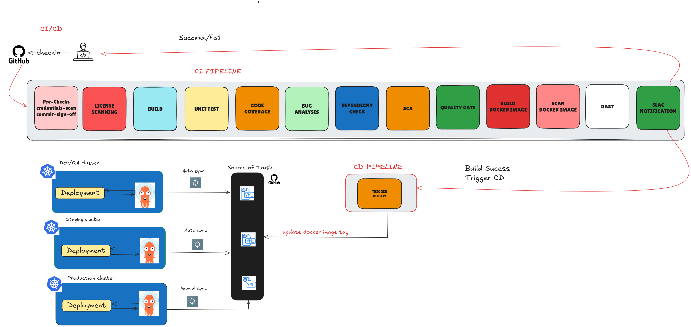

# CI/CD Pipeline Documentation

This document outlines the CI/CD pipeline stages, the tools used at each stage, and their purposes.





## 📁 CI Pipeline (Continuous Integration)

| Stage             | Tool Used                                                 | Purpose                                                                                                                                           |
|------------------|-----------------------------------------------------------|---------------------------------------------------------------------------------------------------------------------------------------------------|
| **Pre-Checks**    | GitHub Actions (`commit-check-action@v1`), Gitleaks       | Validate commit sign-off compliance and scan for any hardcoded secrets or credentials in the codebase.                                            |
| **License Scanning** | License Finder                                         | Ensure open-source license compliance by analyzing dependencies for compatible and approved licenses.                                             |
| **Build**         | Maven                                                     | Compile the Java application and package it into a distributable artifact (JAR/WAR).                                                              |
| **Unit Test**     | JUnit (`spring-boot-starter-test`)                        | Run unit tests to verify the functional correctness of individual components of the application.                                                  |
| **Code Coverage** | JaCoCo                                                    | Measure the extent of code exercised by unit tests; results forwarded to SonarQube for deeper analysis.                                          |
| **Bug Analysis**  | SpotBugs                                                  | Detect static code issues, bugs, and code smells; results also shared with SonarQube for unified reporting.                                      |
| **Dependency Check** | OWASP Dependency-Check                                | Scan project dependencies for known CVEs; the vulnerability report is also forwarded to SonarQube.                                               |
| **SCA (Static Analysis)** | SonarQube                                       | Consolidate and analyze reports from Code Coverage (JaCoCo), Bug Analysis (SpotBugs), and Dependency Check; ensures quality, security, and maintainability. |
| **Quality Gate**  | Sonar Quality Profiles                                    | Enforce custom thresholds such as minimum code coverage %, reliability/security rating, and critical bug limits before proceeding to deployment. |
| **Build Docker Image** | Docker → Push to Amazon ECR                         | Containerize the application and push the image to ECR using IAM role-based authentication (no static access keys used).                          |
| **Scan Docker Image** | Clair (via ECR scanning)                             | Scan the pushed Docker image for OS/package-level vulnerabilities; validate scan results with a shell script to pass/fail based on severity.     |
| **DAST**          | OWASP ZAP (`zaproxy/action-full-scan@v0.12.0`)            | Deploy app via `docker-compose` (along with ScyllaDB and Redis) and scan using ZAP; validate results for high alerts before allowing CD trigger. |
| **Slack Notification** | Slack + Webhook                                    | Notify appropriate team channels on CI status including DAST scan results.                                                                       |
| **Cleanup**       | Shell Script with `gh` cli                            | Remove intermediate build artifacts, temporary Docker images, and deployment files to free up space and maintain a clean runner environment.      |

## 🚀 CD Pipeline (Continuous Deployment)

Once the CI pipeline completes successfully—including build, test, scan, and DAST—the **CD stage** is triggered using **GitHub Actions**.

- The `trigger-CD` job determines the branch context (`dev`, `release-*`, or `main`) and updates the appropriate `kustomization.yaml` file in the GitOps repository.
- It sets the correct **environment path** (`overlays/dev`, `overlays/staging`, or `overlays/prod`) and updates the **image tag** with a new value based on the current build.
- This updated manifest is committed back to the **source of truth** GitOps repository (`NavabShariff/gitops-source`).

Branch-based deployment logic:

- **`dev` branch**:
  - Updates `overlays/dev` in the GitOps repo.
  - Automatically deployed to the **dev/QA cluster** for functional and integration testing.
  
- **`release-*` branches**:
  - Updates `overlays/staging`.
  - Represents a **certified release** candidate for UAT or staging.
  - Automatically deployed to **staging environment** once pushed.

- **`main` branch**:
  - Updates `overlays/prod`.
  - Represents **production-ready** code.
  - Can trigger a **manual sync** or auto-sync based on Argo CD configuration.


## 🔄 GitOps Flow

- **Source of Truth**: Kubernetes manifests are stored in a centralized Git repository (`gitops-source`) with a standard folder structure:
  ```
  ├── base/
  └── overlays/
      ├── dev/
      ├── staging/
      └── prod/
  ```
- **GitHub Actions**: Modifies `kustomization.yaml` in the correct overlay directory by:
  - Determining the current Git branch.
  - Updating the Docker image tag using the Git SHA.
- **Argo CD**:
  - Watches the GitOps repo for changes.
  - Automatically syncs `dev` and `staging` overlays to their respective environments.
  - Optionally, `prod` can be synced manually for controlled releases.

This flow ensures **full traceability**, **environment isolation**, and **automated deployments** with clear promotion paths:  
`dev` ➝ `release-*` ➝ `main`


## 🚀 Deployment Clusters

| Environment | Deployment Method | Sync Type  |
|-------------|-------------------|------------|
| Dev/QA      | ArgoCD            | Auto Sync  |
| Staging     | ArgoCD            | Auto Sync  |
| Production  | ArgoCD            | Manual Sync |


## CI/CD Status


